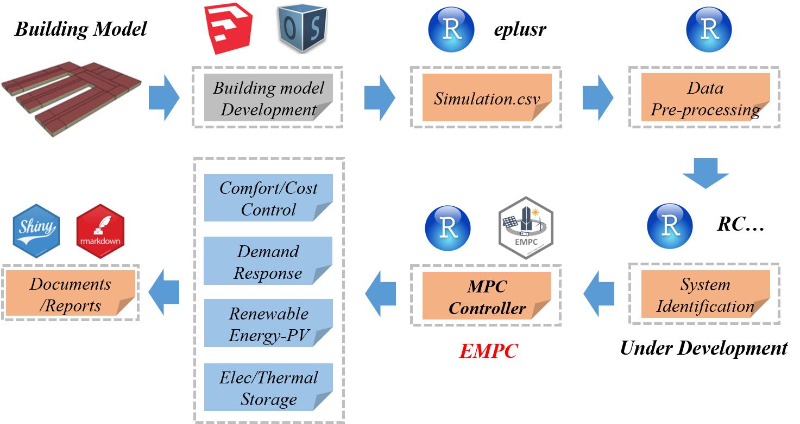

EMPC 
=========================================================

An R module aimed at **MPC** (model predictive control), **EMPC** (economics model predictive control), EMPC-based Demand Response and Energyhub modeling for buildings.

------------------------------------------------------------------------

-   [Framework for Building Simulation in R](#framework-for-building-simulation-in-r)
-   [How MPC in R](#how-mpc-in-r)
-   [Algorithm](#algorithm)
-   [Note](#note)
-   [Features](#features)
-   [Installation](#installation)
-   [Documentation](#documentation)
-   [Support](#support)

Framework for Building Simulation in R
--------------------------------------



How MPC in R
------------

In my opinion, building MPC is a specific convex optimization problem which can be solved with the linear programming algorithm. [**CVXR**](https://github.com/anqif/CVXR) allows R users to formulate convex optimization problems in a natural mathematival syntax rather than the restrictive standard form. Therefore, **EMPC** is developed based on **CVXR**. Besides, [**ECOS**](https://github.com/embotech/ecos) slover, a lightweight conic solver for SOCP(second-order cone programming), is chosen as default solver. Gratitude is extended to [Anqi Fu](https://github.com/anqif) and [Balasubramanian Narasimhan](https://github.com/bnaras) for their amazing packages **CVXR** and [**ECOSolver**](https://github.com/bnaras/ECOSolveR)(an R interface for `ECOS`), repectively.

Algorithm
---------

MPC: For every iteration in **comfort** control (i.e. indoor temperature control), the optimization problem is concluded as:


EMPC:For every iteration in **cost** control (i.e. minimize the electricity cost), the optimization problem is concluded as:


EMPC: If there is a storage or generation component(i.e. simple battery), the optimization problem is concluded as:


Note
----

`EMPC` is only available for simulating **discrete-time linear time-invariant** systems at present.

> In order to obtain discrete state-space model and transform it bettween different timesteps, `c2d` and `d2c` functions are provided.

Features
--------

-   Time-variant constraints, such as temperature range, power/energy inputs are supported.
-   Two control mode, namely **comfort** control and **cost** control are provided.
-   Simple battery and lead-acid battery object models are available.
-   Directly add storage component and generation component to your building component.

> In order to make the package easy-to-use for researchers in building/energy fields, objective function is warpped. Therefore, the users cannot change the optimized object.

Installation
------------

`EMPC` is currently not on CRAN. You can install `EMPC` from Github with:

``` r
devtools::install_github("jywang2016/EMPC")
```

Documentation
-------------

Three examples are given in the `test` file. Here is the example\#1:comfort/cost control with time-variant constrains.

``` r
#rm(list = ls())
library(EMPC)
library(dplyr)

## ----echo=TRUE, message=FALSE, warning=FALSE-----------------------------
load("./inst/extdata/ssM.Rdata")
# state-space model of building
ssmodel <- list(A = ssM$A %>% as.matrix(),
                Bu = ssM$Bu %>% as.matrix(),
                Bd = ssM$Bd %>% as.matrix(),
                C = ssM$C %>% as.matrix())

## ------------------------------------------------------------------------
mpc2 <- mpc$new()
mpc2$initialize() #initialize building

mpc2$building$setvalue(ssmodel = ssmodel,
                       disturbance = as.matrix(ssM$Disturbance),
                       timestep = as.matrix(ssM$timestep),
                       x0 = as.matrix(ssM$x0),
                       continuous = F)

mpc2$building$parameters$ssM

## ------------------------------------------------------------------------
N <- 72 #prediction horizon
Tsim <- 504 #simulation/control horizon
nu <- ncol(ssM$Bu)
ny <- nrow(ssM$C)

ECR <- 1e6
cost <- matrix(0.2, ncol = nu, nrow = (N + Tsim))
ymax <- matrix(26, nrow = ny, ncol = (N + Tsim))
ymin <- matrix(22, nrow = ny, ncol = (N + Tsim))
yref <- matrix(24, nrow = ny, ncol = (N + Tsim))
umax <- matrix(15, nrow = ny, ncol = (N + Tsim))
umin <- matrix(0 , nrow = ny, ncol = (N + Tsim))

timestep <- ssM$timestep %>% as.numeric()
time <- (1:nrow(cost))*timestep
for (i in time) {

  ifelse(i %% 86400 > 10*3600 & i %% 86400 <=16*3600,
         cost[i/timestep,] <- 0.2,
         cost[i/timestep,] <- 0.04)
  ifelse(i %% 86400 <= 8*3600 | i %% 86400 > 18*3600,
         ymax[,i/timestep] <- 30,
         ymax[,i/timestep] <- 26)
  ifelse(i %% 86400 <= 8*3600 | i %% 86400 > 18*3600,
         ymin[,i/timestep] <- 18,
         ymin[,i/timestep] <- 22)
}


## ------------------------------------------------------------------------
mpc2$set_parameters(N = N,
                    Tsim = Tsim,
                    obj = "comfort", #comfort objective function
                    cost = cost,
                    ymin = ymin,
                    ymax = ymax,
                    yref = yref,
                    ECR = ECR,
                    umax = umax,
                    umin = umin)
mpc2$print_para() ##use for print prediction horizon, control horizon, and ssM is continuous or not
mpc2$set_mpc_constraint()

## ------------------------------------------------------------------------
solu <- mpc2$solve_mpc()

## ------------------------------------------------------------------------
temp <- data.frame(time = 1:Tsim,
                   room1 = t(solu$Y)[,1],
                   room2 = t(solu$Y)[,2],
                   room3 = t(solu$Y)[,3])
ele  <- data.frame(time = 1:Tsim,
                   room1 = t(solu$U)[,1],
                   room2 = t(solu$U)[,2],
                   room3 = t(solu$U)[,3])

library(reshape2)
library(ggplot2)

hfactor <- 3600/as.numeric(ssM$timestep )

temp %>% melt(id = "time") %>%
  ggplot(aes(x = time/hfactor , y = value ,color = variable)) +
  geom_line(size = 1) +
  theme_bw()+
  xlab("time/h") + ylab("temperature/degC")

ele %>% melt(id = "time") %>%
  ggplot(aes(x = time/hfactor , y = value ,color = variable)) +
  geom_line(size = 1) +
  theme_bw()+
  xlab("time/h") + ylab("electricity/kw")
```


``` r
## ------------------------------------------------------------------------
mpc2$set_parameters(N = N,
                    Tsim = Tsim,
                    obj = "cost",
                    cost = cost,
                    ymin = ymin,
                    ymax = ymax,
                    yref = yref,
                    ECR = ECR,
                    umax = umax,
                    umin = umin)
mpc2$print_para()
mpc2$set_mpc_constraint()

## ------------------------------------------------------------------------
solu <- mpc2$solve_mpc(control = ecos.control(maxit = 500L,feastol = 5e-6,reltol = 5e-5))

## ------------------------------------------------------------------------
temp <- data.frame(time = 1:Tsim,
                   room1 = t(solu$Y)[,1],
                   room2 = t(solu$Y)[,2],
                   room3 = t(solu$Y)[,3])
ele  <- data.frame(time = 1:Tsim,
                   room1 = t(solu$U)[,1],
                   room2 = t(solu$U)[,2],
                   room3 = t(solu$U)[,3])

library(reshape2)
library(ggplot2)

hfactor <- 3600/as.numeric(ssM$timestep )

temp %>% melt(id = "time") %>%
  ggplot(aes(x = time/hfactor , y = value ,color = variable)) +
  geom_line(size = 1) +
  theme_bw()+
  xlab("time/h") + ylab("temperature/degC")

ele %>% melt(id = "time") %>%
  ggplot(aes(x = time/hfactor , y = value ,color = variable)) +
  geom_line(size = 1) +
  theme_bw()+
  xlab("time/h") + ylab("electricity/kw")
```


To be continued...

Support
-------

Open an issue on the [`EMPC` Github](https://github.com/jywang2016/EMPC) page.

License
-------

The project is released under the terms of the GPL-3.0.

Copyright © 2018 Jiangyu Wang
